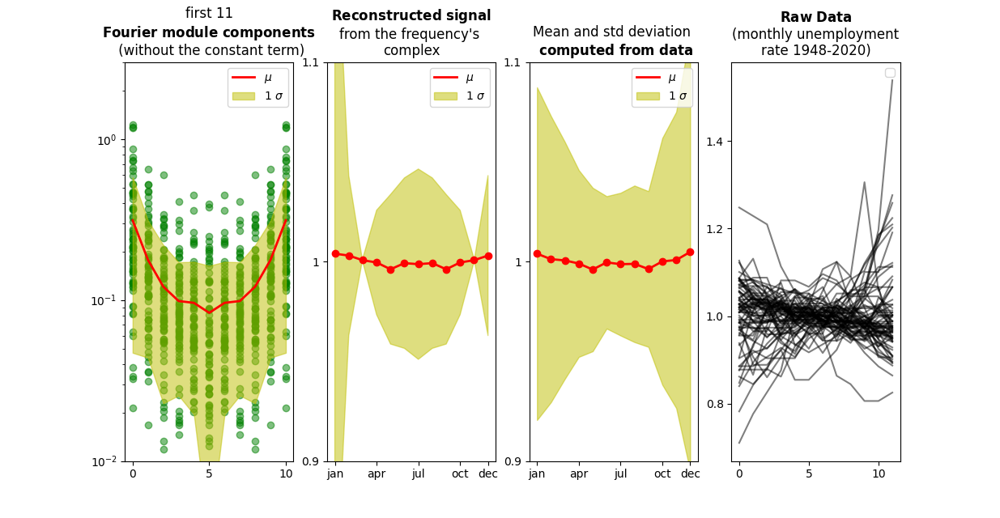
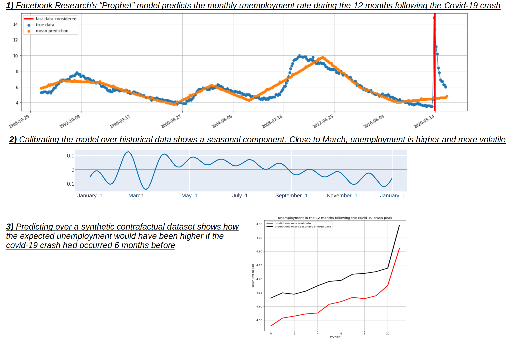

# data-science-usa-unemployment

:cowboy_hat_face: <i>Statistical treatment of the FRED's time-series of the USA unemployment rate 1948 2021</i>

---

# Seasonal Fourier Expansion: "antitransform the fourier expansion's mean insetad of using the sample mean"

---

# Contrafactual Prediction: "what if the covid-19 crash had occured 6 months earlier?"

